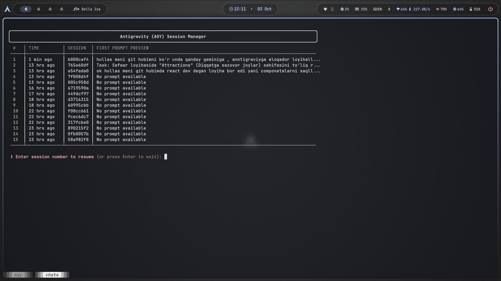

<div align="center">

# 🚀 AgyChat 
### The Ultimate Antigravity Session & Account Manager

A beautiful, zero-dependency Terminal User Interface (TUI) to view, manage, and seamlessly resume [Google Antigravity (AGY)](https://github.com/google/antigravity) CLI sessions, complete with native Multi-Account OAuth switching and live limits checking!



[](#)
[](#)
[](#)
[](#)

[Features](#-features) • [Installation](#-installation) • [Usage](#-usage) • [Architecture](#-architecture)

</div>

---

## ✨ Features

- **🔐 Multi-Account & Limits Checker**: Syncs multiple Antigravity IDE and CLI accounts seamlessly. Press `c` to instantly view and switch between accounts based on remaining limits (`flash`, `pro`, `flash_lite`) across all your emails! Gracefully handles expired tokens.
- **🌍 Multilingual (i18n)**: Fully supports English (`en`), Russian (`ru`), and Uzbek (`uz`). Auto-detects your system language or can be set manually via `--lang`.
- **🎨 Stunning Interactive UI**: Beautiful box-drawn terminal tables with modern ANSI colors, complete with **Live Keyboard Navigation**! Use arrow keys `↑/↓` to select, `Enter` to resume, `s` for live filtering, `t` to tag, and `p` to pin right from the UI.
- **⚡ Zero Dependencies**: Built entirely using Python's Standard Library. No external packages needed. Extremely portable.
- **🚀 Lightning Fast**: Optimized lazy-parsing of massive `.jsonl` transcript logs. It reads only what's necessary, making it blazing fast even with hundreds of sessions.
- **🏷️ Tagging & 📌 Pinning**: Give custom names to your important sessions (`--tag` or `t`) and pin them to the top of the list (`--pin` or `p`).
- **🔍 Live Search**: Type `s` in the UI to instantly filter past sessions in real-time as you type, or use `--search` from the CLI.

## 📦 Installation

We officially support installation via modern Python tool managers like `uv` or `pipx`.

```bash
# 1. Clone the repository
git clone https://github.com/thefarrukhdev/AgyChat.git
cd AgyChat

# 2. Install the main CLI using uv (or pipx)
uv tool install .

# 3. Optional: Install the Multi-Account OAuth Manager
# (Allows flawless switching between IDE & CLI accounts)
mkdir -p ~/.local/bin
cp scripts/agy-oauth-manager ~/.local/bin/
chmod +x ~/.local/bin/agy-oauth-manager
```

Installing the package automatically adds **three** command aliases to your terminal. You can run the tool using any of them:
- `agychat`
- `chats`
- `agy-sessions`

## 🛠️ Usage

### Interactive TUI Mode
Simply run:
```bash
chats
```
**Interactive Keybindings:**
- `[↑/↓]`: Navigate sessions
- `[Enter]`: Resume selected session
- `[c]`: **Check limits and switch active account** (Displays limits across all saved accounts!)
- `[s]`: Live Search
- `[t]`: Tag selected session
- `[p]`: Pin/Unpin selected session
- `[n]`: Start a new session
- `[q]`: Quit

### CLI Commands
```bash
chats 5              # Resume session #5 immediately
chats --lang uz      # Switch the UI to Uzbek permanently
chats -t "Backend" 3 # Assign the name "Backend" to session #3
chats --pin 3        # Pin session #3 to the top
chats -s "react"     # Search for "react" in your history
chats --clear-all    # Safely clear all history
```

## ⚙️ Architecture

AgyChat follows strict **SOLID** and **DRY** principles, modularized into a professional package structure:
- `core/` — Handles lazy file I/O, state management, accounts/limits tracking, and configuration.
- `ui/` — Terminal rendering, dynamic grid alignment, accounts table, and ANSI coloring.
- `i18n/` — Zero-dependency robust translation system with automatic OS language fallback.
- `cli.py` — The core event loop, live search, and CLI argument parsing.

## 🤝 Contributing
Contributions, issues, and feature requests are welcome! Feel free to check the [issues page](https://github.com/thefarrukhdev/AgyChat/issues).

## 📜 License

MIT License. Do whatever you want with it! Built for the developer community.
